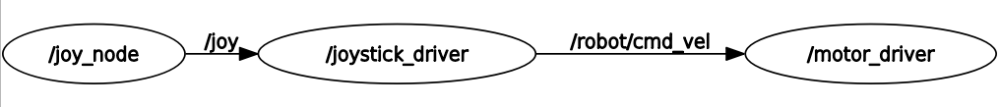

<!-- PROJECT LOGO -->
 

  

  <h3 align="center">Robot ROS - Valrobotik - ENSIAME Valenciennes </h3>

  

    Un projet pour rendre le robot modulaire !!
     
    <a href="https://s6ril.github.io/Robot_ROS_Valrob/"><strong>Documentation »</strong></a>
     
  

<!-- TABLE OF CONTENTS -->
# Sommaire

   * [Cette Branche](#cette-branche)
   * [Construit avec](#construit-avec)
   * [Pour commencer](#pour-commencer)
      * [Préparation de la Raspberry Pi](#préparation-de-la-raspberry-pi)
      * [Installation de ROS](#installation-de-ros)
      * [Préparation de l'environnement ROS](#préparation-de-lenvironnement-ros)
      * [Github](#github)
   * [Utilisation](#utilisation)
      * [Prerequis](#prerequis)
      * [Usage](#usage)
         * [Port de l'Arduino](#port-de-larduino)
         * [Port de la manette](#port-de-la-manette)
         * [Configuration de ROS.](#configuration-de-ros)
         * [Lancement](#lancement)
      * [Licence](#licence)
      * [Contact](#contact)
      * [Acknowledgements](#acknowledgements)

# Cette Branche

Cette branche est une branche de TEST. Elle permet à partir d'un Joystick, d'une Raspberry et d'une Arduino de controller un robot en passant par des nodes ROS. Le driver de moteur peut être adapté pour les différents moteurs. 

Ici je me base sur le composant `L298N` avec 2 moteurs à CC. Les pins de connections à la carte arduino sont définis dans le fichier `Config.h` du code arduino.

  

# Construit avec
Ce robot à dont été développer avec ROS. On retrouve alors :
* [ROS Noetic](https://www.ros.org/)
* [Python 3](https://www.python.org/)
* [Arduino](https://www.arduino.cc/)
* [Raspberry Pi 3](https://www.raspberrypi.org/) avec [Ubuntu Server](https://ubuntu.com/download/raspberry-pi) comme OS

<!-- GETTING STARTED -->
# Pour commencer

## Préparation de la Raspberry Pi

Cela est un résumé de l'installation décrit par Ubuntu. Voir le [lien](https://ubuntu.com/tutorials/how-to-install-ubuntu-on-your-raspberry-pi) pour plus de détails.

Dans mon cas, j'utilise une Raspberry Pi 3b avec 1Go de RAM. Je prends alors la version 32 bits de l'os. Je prépare la carte SD avec Raspberry Pi Imager.

Après le flash, il faut modifier dans la partition `system-boot` le fichier `network-config` et décommenter (et adapter) les lignes suivantes :

    wifis:
      wlan0:
      dhcp4: true
      optional: true
      access-points:
        "home network":
          password: "123456789"

Maintenant la Raspberry peut être démarrée. L'os est configuré pour activer automatiquement la connection SSH.
L'utilisateur et mot de passe par défaut est `ubuntu`. Il est demandé à la première utilisation de changer le mot de passe.

**Attention : Le clavier est sûrement en qwerty !!**

Pour changer le clavier en français, je me base sur ce [site](https://linoxide.com/linux-how-to/configure-keyboard-ubuntu/).

En une ligne, la commande est :

    L='fr' && sudo sed -i 's/XKBLAYOUT=\"\w*"/XKBLAYOUT=\"'$L'\"/g' /etc/default/keyboard

Par habitude, on peut aussi vérifier les mises à jours :

    sudo apt update && sudo apt upgrade -y && sudo apt autoremove -y

Comme l'installation de ubuntu est minimale, il faut installer le paquet `build-essential`

    sudo apt install build-essential

La Raspberry est enfin prête pour pouvoir installer ROS.

## Installation de ROS

Je me base sur le [tutoriel de ROS](http://wiki.ros.org/noetic/Installation/Ubuntu) pour l'installation sous Ubuntu.

Sur la Raspberry il n'est pas utile d'installer entièrement ROS, mais seulement les paquets essentiels. 

On ajout le dépot :

    sudo sh -c 'echo "deb http://packages.ros.org/ros/ubuntu $(lsb_release -sc) main" > /etc/apt/sources.list.d/ros-latest.list'
    sudo apt-key adv --keyserver 'hkp://keyserver.ubuntu.com:80' --recv-key C1CF6E31E6BADE8868B172B4F42ED6FBAB17C654
    curl -sSL 'http://keyserver.ubuntu.com/pks/lookup?op=get&search=0xC1CF6E31E6BADE8868B172B4F42ED6FBAB17C654' | sudo apt-key add -
    sudo apt update

On installe ROS base :
    
    sudo apt install ros-noetic-ros-base

Pour la manette il faut installer le paquet `ros-joystick-drivers` :

    sudo apt install ros-noetic-joystick-drivers

On peut ajouter au terminal l'environnement ROS :
    
    echo "source /opt/ros/noetic/setup.bash" >> ~/.bashrc
    source ~/.bashrc

## Préparation de l'environnement ROS

Je me base sur le [tutoriel de ROS](http://wiki.ros.org/ROS/Tutorials/InstallingandConfiguringROSEnvironment).

Il faut dans un premier temps sourcer le terminal (si ce n'est pas déjà fait) :
    
    source /opt/ros/noetic/setup.bash

Puis créer le ROS Workspace :

    mkdir -p ~/catkin_ws/src
    cd ~/catkin_ws/
    catkin_make -DPYTHON_EXECUTABLE=/usr/bin/python3
  
On impose python 3 pour `catkin_make`. ROS Noetic est le premier ROS à être seulement basé sur Python3. Pour cette version `catkin_make` suffit.

On source à nouveau le workspace (pour prendre en compte les modofications) :

    source devel/setup.bash

On peut alors mettre le code github sur la raspberry !

## Github

Pour récupérer les fichiers de Github :

    git clone -b Robot_test https://github.com/S6ril/Robot_ROS_Valrob.git

(On clone seulement la branche Robot_test qui correspond à la branche de démo avec le joystick.)

Puis on copie le dossier `navigation_valrob` vers `catkin_ws/src` :
    
    cd ~
    cp Robot_ROS_Valrob/src/navigation_valrob catkin_ws/src/

# Utilisation

## Prerequis

Tout ce qu'il y a avant !

La carte Arduino et la manette doivent être branchée sur la Raspberry Pi.

<!-- USAGE EXAMPLES -->
## Usage

### Port de l'Arduino

Dans un premier temps on regarde le port de l'arduino. Pour cela dans l'application Arduino, on le trouve facilement dans outils/port.
Souvent le port est `ttyACM0`. On retient alors `ACM0`.

PS : Si plusieurs cartes ont été connectées, il est probable que le port soit `ACM1`, etc ...

### Port de la manette

Pour la manette, on se base sur la documentation ROS du paquet [Joy](http://wiki.ros.org/joy/Tutorials/ConfiguringALinuxJoystick).

On recherche le port de la manette :
    
    ls /dev/input/

Le port ressemble à quelque chose comme `js0`. On retient ce port.

Il est probable que le port de la manette ne soit pas `js0`. Il faut alors adapter les commandes.
On teste alors la manette :

    sudo jstest /dev/input/js0

On devrait voir toutes les touches de la manette. On l'actionnant, on vérifie que ça fonctionne.

On change les permissions de lecture/écriture, afin que ROS puisse y accéder.

    sudo chmod a+rw /dev/input/js0

### Configuration de ROS.

Dans le fichier `robot.launch`, on modifie les paramètres :

    cd ~/catkin_ws/src/navigation_valrob/launch/
    nano robot.launch

- A la ligne `<param name="dev" type="string" value="/dev/input/js0" />`, on modifie le numéro du Joystick.
- A la ligne `portArduino : "ACM0"`, on modifie le port de l'arduino.

Pour quitter l'éditeur : `CTRL+x` et on valide `y`. (`o` si l'os est en FR).

### Lancement
Le Joystick et l'arduino branché à la raspberry, on peut lancer ROS :

    cd ~/catkin_ws
    roslaunch navigation_valrob robot.launch

Maintenant le robot est controlable avec le Joystick !!

<!-- LICENSE -->
## Licence

Distributed under the MIT License. See `LICENSE` for more information.

<!-- CONTACT -->
## Contact

S6ril & Starfunx

Valrobotik - ENSIAME Valenciennes

Lien du projet : [https://github.com/S6ril/](https://github.com/S6ril/Robot_ROS_Valrob.git)

<!-- ACKNOWLEDGEMENTS -->
## Acknowledgements
* [Template](https://github.com/othneildrew/Best-README-Template)

