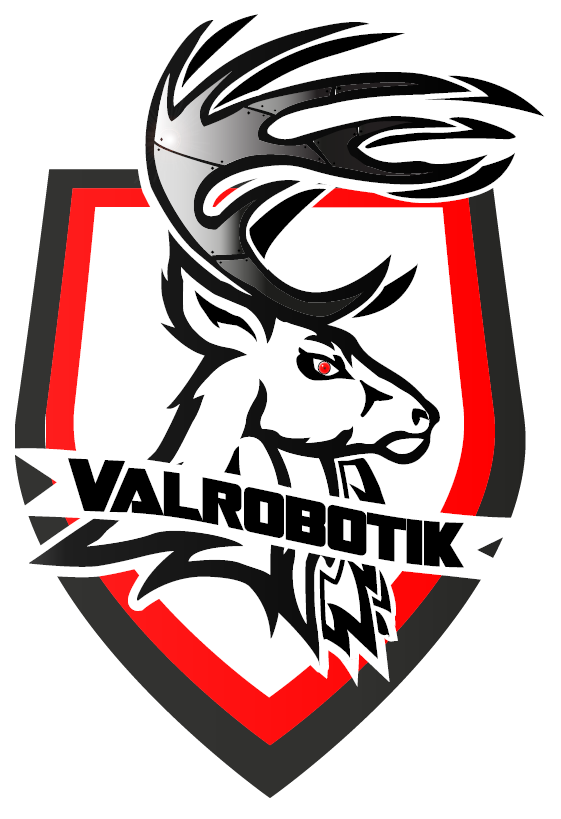

<!-- PROJECT LOGO -->
 

  

  <h3 align="center">Robot ROS - Valrobotik - ENSIAME Valenciennes </h3>

  

    Un projet pour rendre le robot modulaire !!
     
    <a href="https://s6ril.github.io/Robot_ROS_Valrob/"><strong>Documentation »</strong></a>
     
  

# Branche de développement

<!-- TABLE OF CONTENTS -->
## Table of Contents

* [Le Projet](#projet)
* [Construit avec](#construit)
* [License](#license)
* [Contact](#contact)

<!-- ABOUT THE PROJECT -->
## Le Projet

Ce projet a pour but d’initier l’intégration du langage ROS pour le robot Valrob. Cela s’inscrit dans une démarche de rendre le robot modulaire et d’avoir une base solide pour les autres annnées.

Le robot est basé sur une carte Raspberry (cerveau du robot) et d’une carte bas-niveau (arduino, stm32) qui contrôle les moteurs. La communication entre les 2 se fait en Gcode.

On retrouve alors 3 principales branches sur ce GitHub :
* master : la branche principale avec le code autonome.
* Robot_test : une branche de développement qui permet de contrôler le robot avec une mannette de jeux.
* Turtle_demo : une branche théorique qui simule le robot avec une tortue.

Pour plus de précision, veuillez vous réferer à la [Documentation](https://s6ril.github.io/Robot_ROS_Valrob/). Elle explique en détail le code.

## Construit avec
Ce robot à dont été développer avec ROS. On retrouve alors :
* [ROS Noetic](https://www.ros.org/)
* [Python 3](https://www.python.org/)
* [Arduino](https://www.arduino.cc/)
* [Raspberry Pi](https://www.raspberrypi.org/)
* [Ubuntu](https://ubuntu.com/)

<!-- LICENSE -->
## Licence

Distributed under the MIT License. See `LICENSE` for more information.

<!-- CONTACT -->
## Contact

S6ril & Starfunx

Valrobotik - ENSIAME Valenciennes

Lien du projet : [https://github.com/S6ril/](https://github.com/S6ril/Robot_ROS_Valrob.git)

<!-- ACKNOWLEDGEMENTS -->
## Acknowledgements
* [Template](https://github.com/othneildrew/Best-README-Template)

