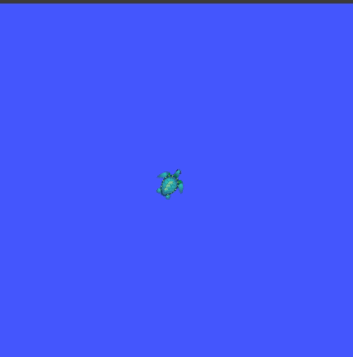

<!-- PROJECT LOGO -->
<br />
<p align="center">
  <a href="https://github.com/S6ril/Diff_Drive_Robot_Ros/blob/master/images/logo_valrob.PNG">
    
  </a>

  <h3 align="center">Robot ROS - Valrobotik - ENSIAME Valenciennes </h3>

  <p align="center">
    Un projet pour rendre le robot modulaire !!
    <br />
    <a href="https://robot-ros-valrob.readthedocs.io/fr/latest/index.html"><strong>Documentation »</strong></a>
    <br />
  </p>
</p>


<!-- TABLE OF CONTENTS -->
## Table of Contents

* [Le Projet](#projet)
  * [Construit avec](#construit)
* [Pour commencer](#commencer)
  * [Prérequis](#prerequis)
* [Usage](#usage)
* [License](#license)
* [Contact](#contact)


<!-- ABOUT THE PROJECT -->
## Le Projet

<p align="center">
 <a href="https://github.com/S6ril/Diff_Drive_Robot_Ros/blob/master/images/tortue_exemple.gif">
    
  </a>
</p>

Ce projet à pour but d'initier l'intégration du langage ROS pour le robot Valrob. Cela s'inscrit dans une démarche de rendre le robot modulaire et d'avoir une base solide pour les autres annnées.

On retrouve alors :
* Sur ce github, un code ROS motion-controller pour faire déplacer le robot.
* Un robot modulaire dont la communication se fait par le port série et une communication GCODE.


### Construit avec
Ce robot à dont été développer avec ROS. On retrouve alors :
* [ROS Noetic](https://www.ros.org/)
* [Python 3](https://www.python.org/)


<!-- GETTING STARTED -->
## Pour commencer

### Prerequis

ROS et Python doivent être installés.


<!-- USAGE EXAMPLES -->
## Usage

Pour lancer le programme sur un ordinateur :
```bash
roslaunch navigation_valrob turtle.launch 
```

_Pour plus de précision, veuillez vous réferer à la [Documentation](https://valrobotik.github.io/Documentation2020/)_


<!-- LICENSE -->
## Licence

Distributed under the MIT License. See `LICENSE` for more information.


<!-- CONTACT -->
## Contact

S6ril & Starfunx

Valrobotik - ENSIAME Valenciennes

Lien du projet : [https://github.com/S6ril/](https://github.com/S6ril/Diff_Drive_Robot_Ros.git)


<!-- ACKNOWLEDGEMENTS -->
## Acknowledgements
* [Template](https://github.com/othneildrew/Best-README-Template)


