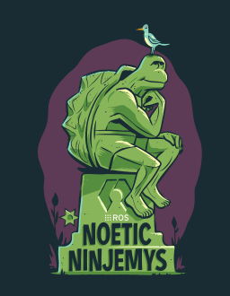

# Prérequis & Installation


``` warning:: Ce Robot a été développé sous Linux (Ubuntu 20.04 lts) et ROS Noetic. Les commandes dans ce tutoriel seront données pour cet OS. 
    Cependant ROS est un langage disponible sur toutes les plateformes. **Les commandes données pour ROS peuvent varier d’une version à l’autre.**
```


<span style="display:block;text-align:center">  </span>


## Installation de ROS sur Ubuntu

Voici un petit résumé :

### Tééchargement des paquets

Je me base sur le [tutoriel de ROS](http://wiki.ros.org/noetic/Installation/Ubuntu) pour l’installation sous Ubuntu.

On ajoute le dépot :

    sudo sh -c 'echo "deb http://packages.ros.org/ros/ubuntu $(lsb_release -sc) main" > /etc/apt/sources.list.d/ros-latest.list'
    sudo apt-key adv --keyserver 'hkp://keyserver.ubuntu.com:80' --recv-key C1CF6E31E6BADE8868B172B4F42ED6FBAB17C654
    curl -sSL 'http://keyserver.ubuntu.com/pks/lookup?op=get&search=0xC1CF6E31E6BADE8868B172B4F42ED6FBAB17C654' | sudo apt-key add -
    sudo apt update

On installe ROS :
    
    sudo apt install ros-noetic-desktop

Cette version est suffisante. Vous pouvez installer la totalité de ROS avec :

    sudo apt install ros-noetic-desktop-full

Pour Raspberry-Pi sous Ubuntu Server OS, il est possible d’installer une version minimale (sans interface graphique) :

    sudo apt install ros-noetic-ros-base


On peut ajouter au terminal l’environnement ROS :
    
    echo "source /opt/ros/noetic/setup.bash" >> ~/.bashrc
    source ~/.bashrc


### Préparation de l’environnement ROS

Je me base sur le [tutoriel de ROS](http://wiki.ros.org/ROS/Tutorials/InstallingandConfiguringROSEnvironment).

Il faut dans un premier temps sourcer le terminal (si ce n’est pas déjà fait) :
    
    source /opt/ros/noetic/setup.bash


Puis créer le ROS Workspace :

```bash
mkdir -p ~/catkin_ws/src
cd ~/catkin_ws/
catkin_make -DPYTHON_EXECUTABLE=/usr/bin/python3
```

On impose python 3 pour `catkin_make`. ROS Noetic est le premier ROS à être seulement basé sur Python3. Pour cette version `catkin_make` suffit.

On source à nouveau le workspace (pour prendre en compte les modofications) :

    source devel/setup.bash


On peut alors mettre le code github sur l’ordinateur !

## Python

Voici la page de téléchargement de [Python](https://www.python.org/downloads/).

Sous Linux, si Python n’est pas installé automatiquement :

    sudo apt install python3


## Téléchargement des codes

Une fois les langages installés, il faut récupérer le code de Github.
On ouvre un terminal, puis : 

    cd ~/
    git clone https://github.com/S6ril/Robot_ROS_Valrob.git
    mv Robot_ROS_Valrob/src/ ~/catkin_ws/

Cela permet de déplacer les codes vers l’envirronement ROS.
C’est bon !! Vous pouvez maintenant compiler le code :

    cd ~/catkin_ws
    catkin_make


PS : Dans le dossier `Robot_ROS_Valrob` vous retrouvez cette documentation.
Pour faire de la place (notamment sur Rapsberry-Pi) :

    cd ~/
    rm -rf Robot_ROS_Valrob

Cela supprime le dossier documentation téléchargé de Github.